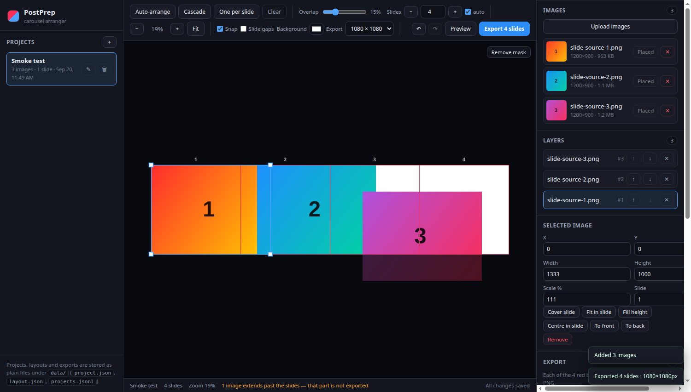
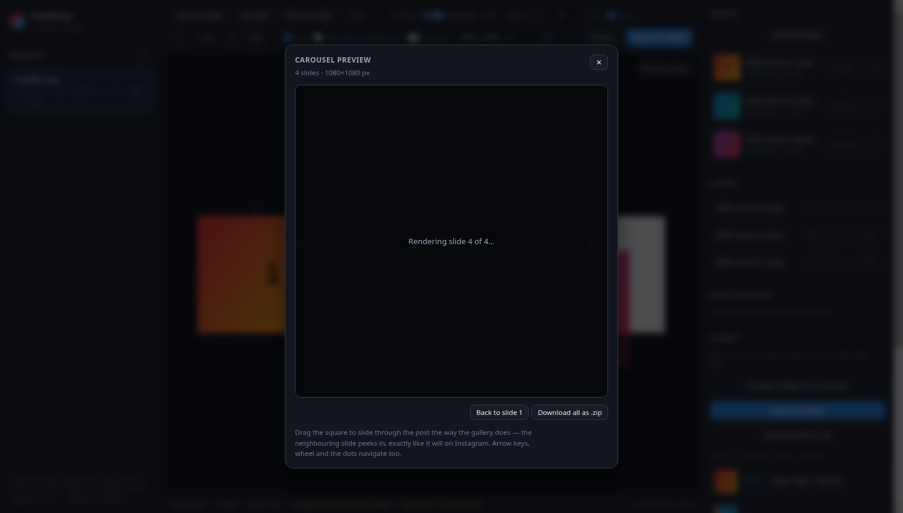

# PostPrep

Turn a few photos into an Instagram **carousel** where the images flow across slide boundaries.



Every photo goes on one continuous plane of 1:1 slides, so an image that crosses a boundary is cut
across two slides — and swiping between them continues the picture. Drag, overlap and resize on that
plane, then export exactly what each slide box contains as its own square PNG.

## Capabilities

- **Continuous slide plane** — 1000 × 1000 world units per slide; drag an image across a boundary and
  two slides share its content.
- **Layout tools** — proportional resize, snapping, layer order, undo/redo, nudge, zoom and pan.
- **Auto-arrange** — left-to-right flow at slide height with a tunable overlap (15 % by default), plus
  Cascade and One-per-slide.
- **Crop mask** — everything outside the slides is dimmed on the canvas but stays fully visible while
  you position; it never affects the export.
- **Carousel preview** (<kbd>P</kbd>) — swipe the real rendered slides at export size, exactly as the
  gallery will show them.

  

- **Export** — 1080 / 1350 / 1440 / 2048 px square PNGs, downloaded individually or as one `.zip`.
- **Autosave** — layout edits save debounced, and the open project is remembered between visits.

## Under the hood

|             |                                                                                              |
| ----------- | -------------------------------------------------------------------------------------------- |
| Server      | **Deno**, single file (`server.ts`), **zero dependencies**                                    |
| Front end   | plain **ES modules + `<canvas>`** — no build step, no framework                               |
| Storage     | plain files: `project.json`, `layout.json`, append-only `projects.jsonl` / `exports.jsonl`     |
| Uploads     | PNG/JPEG/GIF/WebP ≤ 40 MB; dimensions read from **file headers only**, never decoded           |
| Rendering   | slides rendered in the browser at export size; ZIP written client-side (store-only)            |
| Limits      | 10 slides (Instagram's carousel cap), exports 320–4096 px                                      |

## Quickstart

```sh
deno task start   # http://127.0.0.1:8787
deno task dev     # same, reloading on file changes
deno task test    # 42 unit + HTTP integration tests
deno task smoke   # headless Chrome end-to-end: upload → arrange → export → verify
```

Requires Deno 2.x and nothing else. Data lives in `data/` (override with `POSTPREP_DATA`).

See [`docs/requirements.md`](docs/requirements.md) for the full requirements and acceptance criteria.
