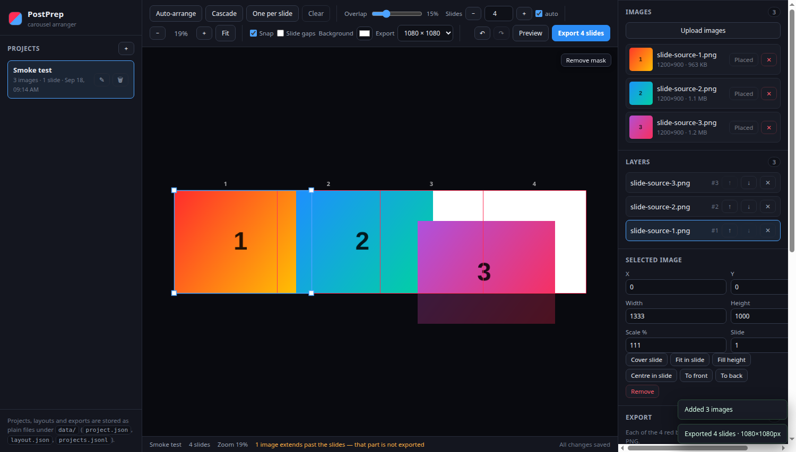
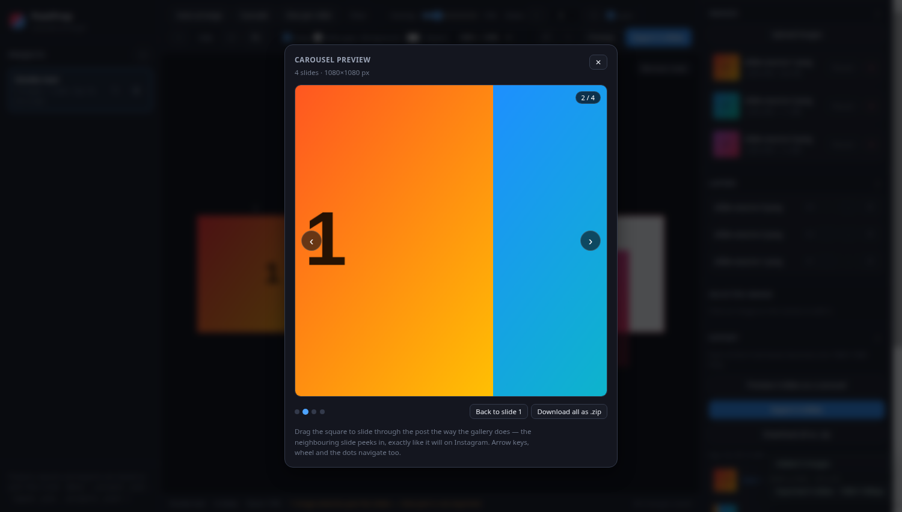

# PostPrep

Turn a handful of photos into an Instagram **carousel** where the images flow into each other.

Instagram shows a multi-image post as a horizontal slide box, so a photo that continues across a
slide boundary makes people swipe. PostPrep gives you a strip of 1:1 slides laid out side by side,
lets you drag, overlap and resize the source images across those boundaries, and then exports
exactly what each red box contains as its own square PNG.

- Server: **Deno** (`server.ts`, no third-party dependencies)
- Front end: **plain JavaScript ES modules** + `<canvas>` (no build step, no framework)
- Storage: **plain files** — JSON documents and append-only JSONL logs



## Quickstart

```sh
deno task start        # http://127.0.0.1:8787
deno task dev          # same, reloading on file changes
```

Then, in the browser: **＋** to create a project, upload a few photos, drag them around, and press
**Export slides**. Exports land in `data/projects/<id>/exports/` and can be downloaded individually
or as a `.zip`.

Requirements: Deno 2.x. Nothing else — `deno task test` and `deno task smoke` run offline.

## The editing model

```
world units (1000 per slide)

slide 1        slide 2        slide 3
┌──────────┬──────────┬──────────┐
│  photo A │  A → B   │  photo C │      each ┤ is an exported 1080×1080 PNG
└──────────┴──────────┴──────────┘
0         1000       2000       3000
```

- One slide is **1000 × 1000 world units**; slide _i_ covers `x ∈ [i·1000, (i+1)·1000]`,
  `y ∈ [0, 1000]`.
- Every uploaded image is placed on that shared plane: **left to right, scaled to the slide height,
  each one offset so it overlaps the previous image by 15 %** (the "slight x offset" from the
  brief). Adjust the overlap and hit **Auto-arrange** to re-flow, or use **Cascade** / **One per
  slide**.
- Slide boundaries are drawn as thin red vertical lines. Whatever falls inside a box is exported.
- Photos are always drawn at **full opacity**, everywhere — nothing is faded out or made
  see-through, so overlaps read exactly like they will in the post.
- Everything that is **not** exported is covered by a dark **crop mask** drawn on the canvas itself,
  with the slide squares punched out of it. The mask belongs to the window, not to your photos, and
  `Remove mask` / <kbd>M</kbd> takes it away so the whole arrangement is fully lit (handy while
  positioning). It never affects the export.
- Because the plane is continuous, dragging an image across a boundary is all it takes to make two
  slides share content — that is the swipe effect.
- **Slide gaps** previews the slides pushed apart the way a carousel displays them, which makes the
  overlap obvious. The gaps are masked too, since they are not exported.

## Controls

| Action                         | How                                                                                  |
| ------------------------------ | ------------------------------------------------------------------------------------ |
| Move an image                  | drag it (snaps to slide edges and other images)                                      |
| Ignore snapping while dragging | hold <kbd>Alt</kbd>                                                                  |
| Resize (proportional)          | drag a corner handle                                                                 |
| Pan                            | <kbd>Space</kbd>+drag, middle-drag, or empty-space drag                              |
| Zoom                           | wheel (zooms at the pointer), <kbd>+</kbd> / <kbd>-</kbd>, **Fit** / <kbd>F</kbd>    |
| Nudge                          | arrow keys (<kbd>Shift</kbd> = 25 units)                                             |
| Remove from layout             | <kbd>Delete</kbd>                                                                    |
| Layer order                    | <kbd>[</kbd> / <kbd>]</kbd>, or the Layers panel                                     |
| Undo / redo                    | <kbd>Ctrl/Cmd</kbd>+<kbd>Z</kbd> / <kbd>Ctrl/Cmd</kbd>+<kbd>Shift</kbd>+<kbd>Z</kbd> |
| Show / remove the crop mask    | <kbd>M</kbd>, or the **Remove mask** button on the canvas                            |
| Preview the carousel           | <kbd>P</kbd>, or **Preview**; then drag / arrow keys / wheel / dots                  |
| Upload                         | **Upload images**, or drop files onto the canvas                                     |
| Deselect                       | <kbd>Esc</kbd>                                                                       |

Layout edits autosave (debounced) and the selected project is remembered between visits.

## Previewing the carousel

Press **Preview** (<kbd>P</kbd>) to open a 1:1 box with the real rendered slides and slide through
them the way the post will behave:



- **Drag the square** to swipe; the neighbouring slide slides in, which is exactly the effect the
  overlapping arrangement is for. Release to snap to the nearest slide (a quick flick moves one).
- Arrow keys, the mouse wheel, the ‹ › arrows and the dots navigate too; <kbd>Home</kbd> /
  <kbd>End</kbd> jump to the ends and <kbd>Esc</kbd> closes.
- The frames are rendered at the export size from the same code path as the export, so what you see
  is what you get — including the counter (`2 / 4`) the gallery shows.

## Exporting

1. Set the export size (1080 / 1350 / 1440 / 2048 px squares).
2. Press **Export slides** — the browser renders each slide from the source images at full
   resolution and uploads the PNGs to the project.
3. Grab them from the **Export** panel: each slide has a download link, and **Download all as .zip**
   packs the run into a single archive (the ZIP is written in the browser, store-only, no
   dependencies).

## What is stored where

```
data/
  projects.jsonl                       append-only registry log (last write wins)
  projects/<id>/project.json           project document: meta + image index
  projects/<id>/layout.json            the arrangement (x, y, scale, z per image)
  projects/<id>/exports.jsonl          append-only export log
  projects/<id>/images/<img_…>.png     original uploads, untouched
  projects/<id>/exports/<exp_…>.png    rendered 1:1 slides
```

`projects.jsonl` is the index and is replayed on start-up (deletes are recorded as tombstones), so
it can be compacted or hand-edited safely. Deleting a project removes its folder. Set
`POSTPREP_DATA` (or pass `dataDir`) to store data somewhere else.

## HTTP API

| Method                 | Path                              | Purpose                                                 |
| ---------------------- | --------------------------------- | ------------------------------------------------------- |
| `GET`                  | `/api/health`, `/api/config`      | health check, frame/limit constants                     |
| `GET` `POST`           | `/api/projects`                   | list / create projects                                  |
| `GET` `PATCH` `DELETE` | `/api/projects/:id`               | read / update meta / delete                             |
| `GET` `PUT`            | `/api/projects/:id/layout`        | read / replace the arrangement                          |
| `POST`                 | `/api/projects/:id/images`        | multipart upload (`images`, PNG/JPEG/GIF/WebP, ≤ 40 MB) |
| `GET` `DELETE`         | `/api/projects/:id/images/:file`  | serve an original / delete an image                     |
| `GET` `POST` `DELETE`  | `/api/projects/:id/exports`       | list / store rendered slides / clear                    |
| `GET`                  | `/api/projects/:id/exports/:file` | download a rendered slide                               |

Image dimensions are read from the file headers server-side (PNG, JPEG, GIF and WebP are parsed
directly), so uploads are validated and laid out without a decode step.

## Project layout

```
server.ts                  HTTP routing, static files, entrypoint
src/store.ts               file/JSONL persistence, validation, project mutations
src/images.ts              header-only image sniffing (PNG/JPEG/GIF/WebP)
src/util.ts                ids, atomic writes, mutex, JSONL helpers
public/index.html          editor shell
public/styles.css          dark editor theme
public/js/app.js           state, panels, upload/export flows
public/js/geometry.js      pure layout maths (frames, hit-testing, snapping, resize)
public/js/renderer.js      canvas renderer (full-opacity photos, crop mask, red borders)
public/js/interactions.js  pointer, wheel and drag-and-drop gestures
public/js/preview.js       swipeable 1:1 carousel preview modal
public/js/api.js           JSON API client
public/js/zip.js           dependency-free ZIP writer
tests/                     42 unit + HTTP integration tests
tools/smoke.ts             headless-Chrome end-to-end test (screenshots the editor)
```

## Tests

```sh
deno task test      # unit + integration (store, image sniffing, geometry, zip, API)
deno task smoke     # real server + real browser: upload → arrange → export → verify
deno task check     # type-check
```

`deno task smoke` drives the actual UI in headless Chrome, exports four slides and asserts that the
PNGs are 1080×1080, distinct, and that slide 2 really contains two different source images. It
writes `tools/smoke-screenshot.png`, plus `tools/smoke-preview.png` while the carousel preview is
mid-swipe (shown above).

## Notes and limitations

- Exports are rendered in the browser (the server stores files, it never decodes pixels), so
  exporting needs the tab open and the source images loaded.
- Stage size is capped at 10 slides — Instagram's carousel limit.
- Images are placed unrotated; rotation is the obvious next feature, followed by per-slide text
  overlays and a drag-to-reorder slide filmstrip.
- `data/` is plain files: back it up by copying the folder.

See [`docs/requirements.md`](docs/requirements.md) for the formalised requirements and acceptance
criteria this implementation was built against.
